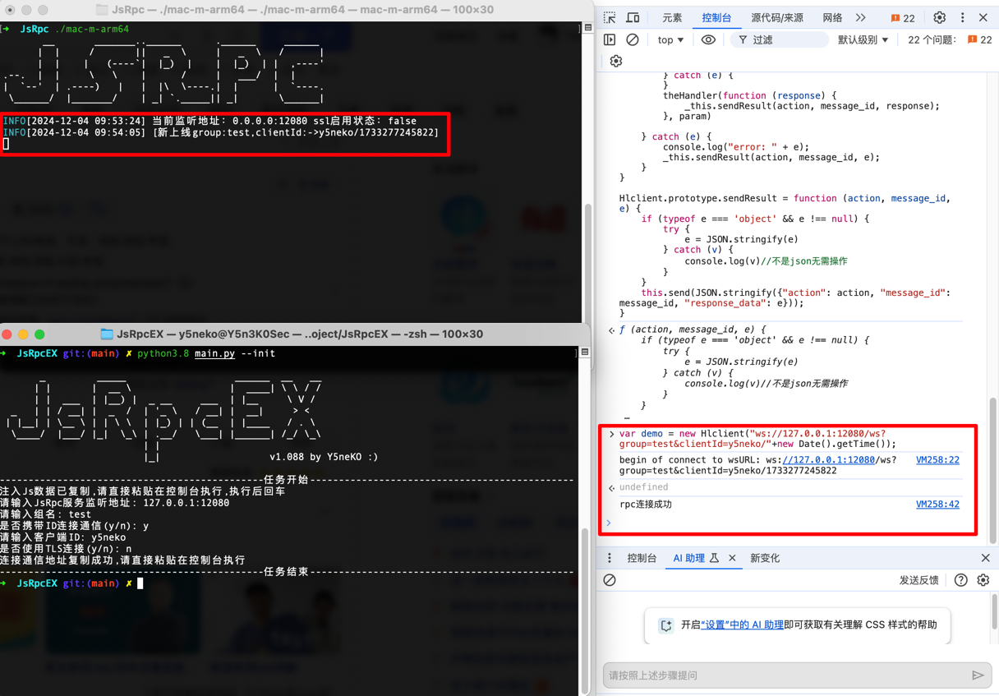

# JsRpcEX
快捷使用JsRpc项目
JsRpc项目地址：https://github.com/jxhczhl/JsRpc

## 使用帮助
```zsh
JsRpcEX>python main.py -h

       _         _____                   ______  __   __
      | |       |  __ \                 |  ____| \ \ / /
      | |  ___  | |__) |  _ __     ___  | |__     \ V /
  _   | | / __| |  _  /  | '_ \   / __| |  __|     > <
 | |__| | \__ \ | | \ \  | |_) | | (__  | |____   / . \
  \____/  |___/ |_|  \_\ | .__/   \___| |______| /_/ \_\
                         | |
                         |_|                   v1.088 by Y5neKO :)

usage: main.py [-h] [--init] [--execjs]

JsRpc执行器

optional arguments:
  -h, --help  show this help message and exit
  --init      获取需要注入的Js数据
  --execjs    进入执行模式
```
因为注入js的内容不同，需要保证和JsRpc的版本一致。

### 获取需要注入的Js数据


### 连接websocket
先启动JsRpc本体，再在控制台连接websocket


### 进入执行模式


其余用法请参考JsRpc项目本体